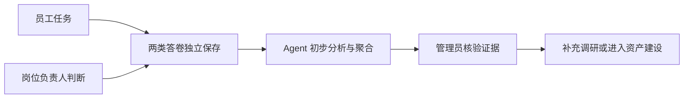

# AI 需求调研工具

面向企业内部的 AI 需求发现工具。它分别收集员工的真实任务和岗位负责人的工作判断，再将两类信息整理成有来源、可比较、可继续验证的需求场景。

系统不替管理员立项，也不对员工评分。Agent 只负责摘要、归并和证据整理，最终判断仍由管理员完成。

## 解决的问题

传统问卷直接询问“希望 AI 做什么”，得到的往往是零散愿望，缺少任务现场、输入输出和影响范围。这个项目采用双视角采集：

- 员工说明实际任务、当前做法、主要问题和 AI 使用情况；
- 岗位负责人补充共性任务、结果要求和协作约束；
- 管理后台通过数据总览、需求分析和证据对比帮助管理员继续判断。



## 已实现范围

- 普通用户与管理员双入口登录；
- 员工任务问卷与岗位负责人问卷；
- 个人答卷、更新记录和初步复盘；
- 管理员数据总览、需求分析、证据对比与原始答卷查看；
- Supabase Auth、PostgreSQL、RLS 和版本化迁移；
- Netlify Functions 中的分析任务、重试和聚合；
- 可独立配置的 OpenAI 兼容 API，默认不调用模型。

## 技术栈

- React 19、TypeScript、Vite
- Supabase Auth、PostgreSQL、RLS
- Netlify Functions
- Vitest、Testing Library、Playwright

## 本地运行

要求 Node.js 22 或更高版本。

```powershell
npm ci
npm run dev
```

公开展示版默认使用浏览器中的 mock 数据，不需要 Supabase 或 OpenAI 即可查看主要页面。

## 可选的 Supabase 配置

复制 `.env.example` 为未提交 Git 的 `.env.local`：

```dotenv
VITE_DATA_MODE=supabase
VITE_SUPABASE_URL=
VITE_SUPABASE_PUBLISHABLE_KEY=
```

服务端使用的 `SUPABASE_SERVICE_ROLE_KEY`、`OPENAI_API_KEY` 和内部任务密钥只能配置在 Netlify 环境变量中，不能写入前端、仓库或构建日志。

## 验证

```powershell
npm run verify
```

该命令依次执行类型检查、单元测试、迁移与 RLS 检查、生产构建、客户端密钥扫描和分析契约检查。

## 数据与安全边界

- 仓库不包含真实员工答卷、生产密钥或数据库备份；
- 示例账号和问卷数据均为合成数据；
- 普通用户只能读取自己的资料和答卷；
- 管理员权限由服务端角色与 Supabase RLS 共同控制；
- 将应用开放给公众前，应增加邀请、邮箱限制或 CAPTCHA，并配置调用限额；
- 用户输入可能发送给外部模型时，应先提供隐私说明和数据保留规则。

## 项目状态

当前版本适合产品演示、试点和二次开发。它不是完整的企业级需求审批系统，也不应直接用于员工绩效评价。

## License

[MIT](LICENSE)
